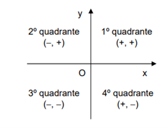

# MATEMÁTICA E LÓGICA

## (ARA0105 / 2023.2) Turma 9001

#### _Disciplina Digital_
#### 2️⃣ AVALIANDO O APRENDIZADO

1.  No cartão da Mega Sena, uma aposta corresponde à escolha de 6 números diferentes, dos 60 dis­poníveis.

    Quantas seriam as apostas possíveis se, ao invés de 60 números, fossem escolhidos apenas números de 1 a 20?

    - C₆²⁰ 👈🏽
    - P₂₀
    - A₆²⁰
    - C₆⁶⁰
    - A₆⁶⁰

---

**Resposta:**

$$
C(20,6)=\frac{20!}{6!(20−6)} × 1
$$

$$
C(20,6)=\frac{6×5×4×3×2×1}{20×19×18×17×16×15} × 1
$$

$$
C(20,6)=38760
$$

---

2. No gráfico a seguir tem-se o número de vagas fechadas a cada mês na indústria paulista, no ano de 1998. A partir desse gráfico, conclui-se corretamente que, em relação à indústria paulista no ano de 1998:

   

   - No terceiro trimestre, diminuiu o número de desempregados.
   - Em dezembro havia menos desempregados que em janeiro.
   - Durante o primeiro trimestre, a taxa de desemprego diminuiu.
   - O número de vagas fechadas no segundo semestre foi menor que 45.000.
   - No primeiro semestre, foram fechadas mais de 62.000 vagas. 👈🏽

---

3. Assinale a alternativa que representa o conjunto de todos os números reais para os quais está definida a função abaixo:

   $$
   f(x)=\frac{\sqrt{x²−6x+5}}{3\sqrt{x²−4}}
   $$

   - (-∞, 1) ∪ (5, +∞).
   - R − {−2, 2}.
   - (−∞, 2) ∪ (−2, 1) ∪ [5, +∞).
   - (−∞, −2) ∪ [2, +∞).👈🏽
   - (−∞, 2) ∪ (5, +∞).

---

**Resposta:**

$$
x²-6x+5≥0 \\
(x-1)(x-5)≥0 \\
x≤1 ∨ x≥5
$$

$$
x² - 4 > 0
\\
(x-2)(x+2) > 0
\\
x<-2 ∨ x>2
$$

$$
 x∈(−∞, −2) ∪ (2, +∞)x∈(−∞, −2) ∪ (2, +∞) \\
 (−∞, −2) ∪ (2, +∞)
$$

---

4. Sejam `p` e `q` proposições. Das alternativas a seguir, apenas uma é tautologia. Assinale-a.

   - `(p ∧ q) ⟶ q` ❌ _verdadeira apenas quando p é verdadeira ou q é falsa_

   - `p ∨ q` ❌ _pode ser falsa quando ambas p e q são falsas_

   - `∼p ∧ ∼q` ❌ _é verdadeira apenas quando p e q são ambas falsas_
   - `(p ∨ q) ⟶ q` ✅ _a implicação é sempre verdadeira, independentemente dos valores de p e q_
   - `p ∧ q` ❌ _é verdadeira apenas quando p e q são ambos verdadeiros._

---

5. Marque a alternativa correta que indica a estrutura de um fato:

   - come(Paula, Chocolate).
   - come(paula, chocolate). 
   - come(Paula, chocolate). 👈🏽
   - Come(paula, chocolate).
   - Come(Paula, chocolate).

---

6.  Se n=a.b, com a e b inteiros posistivos, então `a ≤ √n` ou `b ≤ √n`. Nesse contexto, analise as afirmações a seguir de tal forma que seja possível demonstrar que tal proposição é verdadeira.

    I. Suponhamos que `n=a.b` e `a > √n` e `b > √n`.

    II. Vamos analisar `a.b`:

    `a.b > √n.√n = (√n)² = n` o que contradiz a hipótese.

    III. Portanto, se `n = a.b`, com a e b inteiros positivos, então `a ≤ √n` ou `b ≤ √n`

    É correto o que se afirma em:

    - I, apenas.
    - I e III apenas.
    - I e II apenas.
    - II e III apenas.
    - I, II e III. 👈🏽

---

7.  Dados os conjuntos:

    $$
    A = [1; \frac{3}{2}]
    $$

    $$
    B = [ -1; \frac{5}{3}]
    $$

    o conjunto `A ∪ B` pode ser representado pelo intervalo:

    - `[ -1; 5/3 ]` 👈🏽
    - `] 1; -1 [`
    - `[ -1; 3/2 [`
    - `[ 1; 5/3 ]`
    - `] 1; 5/3 ]`

    ***

    Resposta:

    O menor número em A é 1
    O menor número em B é -1
    O maior número em A é 3/2
    O maior número emB é 5/3

    `A ∪ B = ]1; 3/2[ ∪ [-1; 5/3]`

    Portanto, `[ -1; 5/3 ]`

    ***

8.  Traçando dois eixos, OX ao qual chamaremos eixo das abscissas e OY que chamaremos eixo das ordenadas, de forma que ambos se interceptem perpendicularmente em O, o plano sobre o qual construímos esses eixos fica dividido em quatro quadrantes:

    

    Considere as sentenças:

    I. (0, 1) = (1, 0)

    J. (−1, 4) ∈ 3º quadrante

    K. (2, 0) ∈ ao eixo y

    L. (−3, −2) ∈ 3º quadrante

    Assinale a alternativa correta:

    - (I);(J);(K);(L) são verdadeiras.
    - (I);(J) São falsas e e (L);(K) são verdadeiras.
    - (I);(J);(K) São falsas e (L) é verdadeira. 👈🏽
    - (I);(J);(K);(L) São falsas
    - (I);(K) São falsas e e (L);(J) são verdadeiras

---

**Resposta:**

I. (0, 1) = (1, 0) - ❌ (0, 1) representa o ponto no eixo das ordenadas (eixo y), e (1, 0) representa o ponto no eixo das abscissas (eixo x). Eles não são iguais. Portanto, esta sentença é falsa.

J. (-1, 4) ∈ 3º quadrante - ❌ Um ponto está no 3º quadrante se ambas as coordenadas (x, y) forem negativas. Neste caso, (-1, 4) tem x negativo e y positivo, então não está no 3º quadrante.

K. (2, 0) ∈ ao eixo y - ❌ O ponto (2, 0) está no eixo das abscissas (eixo x), não no eixo das ordenadas (eixo y).

L. (-3, -2) ∈ 3º quadrante - ✅ O ponto (-3, -2) tem ambas as coordenadas (x, y) negativas, o que o coloca no 3º quadrante. Portanto, esta sentença é verdadeira.

---

9. Seja `f:R→R`, definida por:

   $$

   F(x) = \left\{
   \begin{aligned}
       −x−1, \ se \ x≤−1 \\
       −x2+1, \ se \ −1 < x <1 \\
       x−1, se x≥1
   \end{aligned}
   \right.

   $$

   então o conjunto imagem de `f` é dado por:

   - `[−1,1]`
   - `[1,+∞[`
   - `]−∞,−1]`
   - `[0,+∞[` 👈🏽
   - `]−∞,1]`

---

10. Considere os símbolos e seus significados:

    ~ − negação

    ∧ − conjunção

    ∨ − disjunção

    ⊥ − contradição

    T - tautologia

    Sendo F e G proposições, marque a expressão correta:

    - (F∨G)∧ ∼(∼F∧ ∼G)= ⊥ .
    - (F∨G)∧ (∼F∧ ∼G)= F∨G.
    - (F∨G)∧ (∼F∧ ∼G)= ⊥ . 👈🏽 _ressalta uma contradição_
    - (F∨G)∧ ∼(∼F∧ ∼G)= F∧G .
    - (F∨G)∧ (∼F∧ ∼G)= T;.
